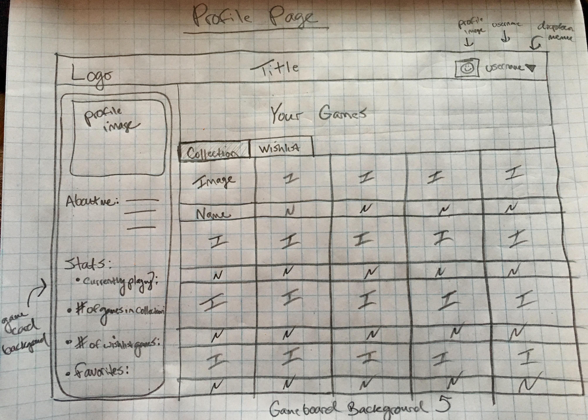
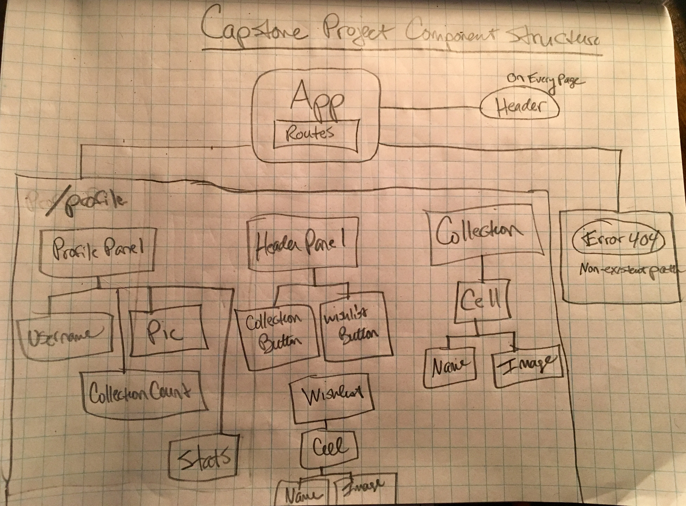
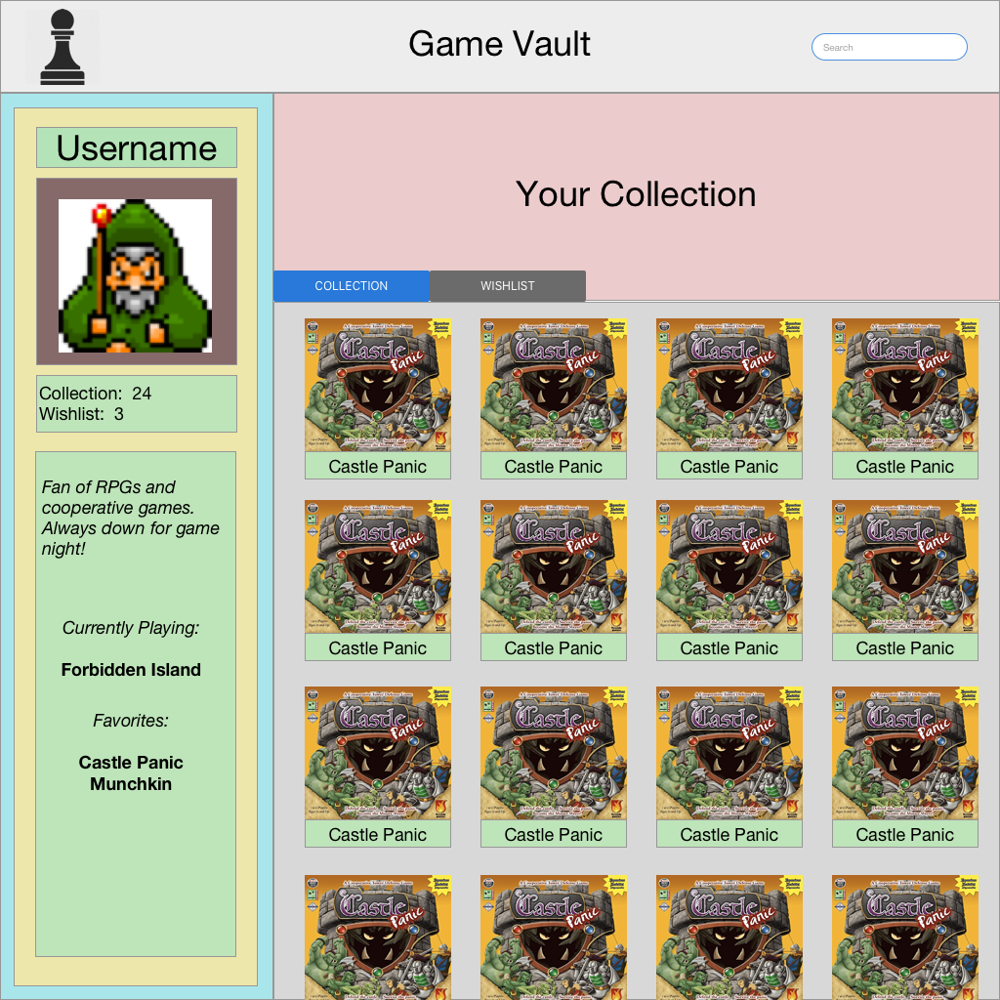

# **Capstone Project Static Site**

#### _An online portal to organize your board game collection, 11.30.2018_

###### By Colin Cook

###  _Please visit the following link to view the planning repository for this site_ 
[Capstone Project Planning Repository](https://github.com/ccook987/capstone-project.git)

## Description

This application is a cataloging website that allows users to search through a database of board games and add them to their online collection. Users can sort their collection by certain criteria, designate games as favorites and add reviews and comments to those games.

## Specifications

_Target Users:_

* Board game owner wanting to organize their collection
* Board game player looking for new games to play

_User Stories:_

* As a board game owner, I want to be able to search the database to find games that I currently own.
* As a board game owner, I want to be able to add games to my online collection.
* As a board game owner, I want to be able to organize the games that I have added to my collection.
* As a board game owner, I want to be able to add reviews for the games in my collection.
* As a board game owner, I want to be able to designate certain games as 'favorites'.
* As a board game owner, I want to be able to designate which game I am currently playing.

* As a board game player, I want to be able to easily search for new games to play.
* As a board game player, I want to be able to filter my searches by certain criteria to match the type of game I am looking for.
* As a board game player, I want to be able to see photos, details and reviews of each game in my search results.
* As a board game player, I want to be able to add games from my search results to my wish list.

## Images

#### Initial Sketches

_Low Fidelity Draft of Profile Page_

_Component Tree_

#### Wireframes

_High Fidelity Draft of Profile Page_

## Project Proposal

Name of Student: Colin Cook

Name of Project: Board Game Organizer

Project’s Purpose or Goal:

This application will serve as a hub for lovers of board games to be able to compile and view all of their favorite games in one place. This program will allow users to search through a database of board games and add specific ones to their list. A user can then organize their personal game collection for others to see. Additionally, they will be able to add personal stats, comments and reviews to each game in their collection.

List the absolute minimum features the project requires to meet this purpose or goal:

* A user will be able to enter search terms to return a list of board games that match their criteria.

* A user will be able to add a game from the search results to their personal collection.

* A user will be able to add comments and reviews to each of the games in their collection.

* A user will be able to organize their game collection to denote favorites, recently played and currently playing.

What tools, frameworks, libraries, APIs, modules and/or other resources (whatever is specific to your track, and your language) will you use to create this MVP? List them all here. Be specific.

* BoardGameGeek API
* React
* Redux
* Firebase

If you finish developing the minimum viable product (MVP) with time to spare, what will you work on next? Describe these features here: Be specific.

* Multiple profiles with user authentication
* Social media interactions such as adding friends and messaging capabilities

## Setup/Installation Requirements

* Clone repository from [GitHub](https://github.com/ccook987/capstone-project.git) to your computer
* In Terminal, navigate to program directory
* Type ``npm install`` to install dependencies
* Type ``npm run start`` to view the application in the browser

## Technologies Used

* NPM
* HTML5
* CSS
* React
* Redux
* Webpack
* Babel
* ESlint
* Sketch
* Firebase
* BoardGameGeek API

## Support and contact details

I would love to hear from you! If you have any issues with this application or have any suggestions on how it could be improved, please let me know.

Contact me at [ccook987@gmail.com](mailto:ccook987@gmail.com)

### License

This software is licensed under the MIT license.

Copyright (c) 2018 Colin Cook
